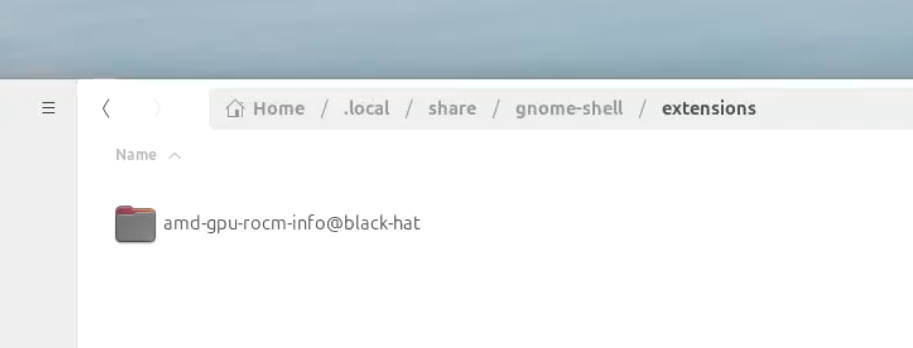

如何使用

1. 安装gnome-shell-extension manager
   
    <code>https://mattjakeman.com/apps/extension-manager</code>
2. 下载源码，并解压，拷贝到 `~/.local/share/gnome-shell/extensions/`
   
   

3. 打开 Extension Manager

    
4. 登出
5. 效果
    
    
