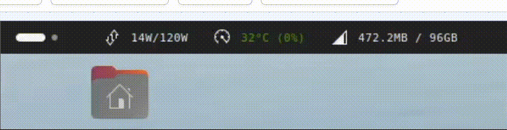

如何使用

1. 安装gnome-shell-extension manager
   
    <code>
      sudo apt install gnome-tweak-tool
      sudo apt install gnome-shell-extensions
    </code>
2. `sudo bash setup.sh`

3. 打开 Extension Manager

    
   
4. 登出，重新登录
   
5. 效果
    
    
